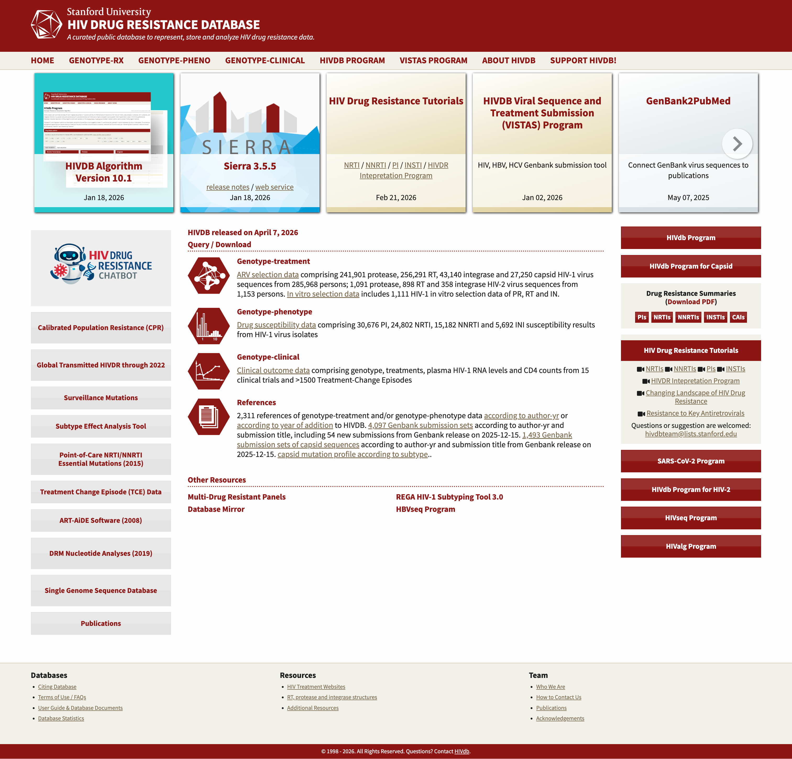
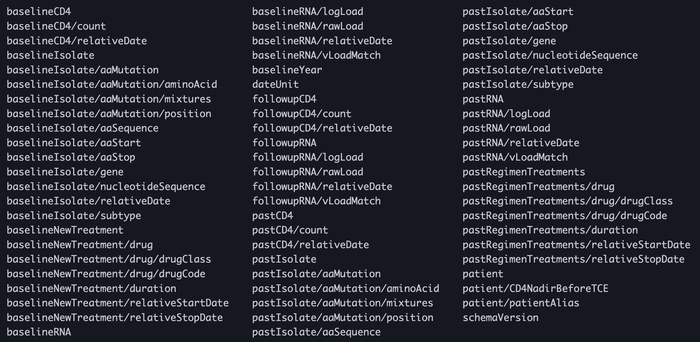
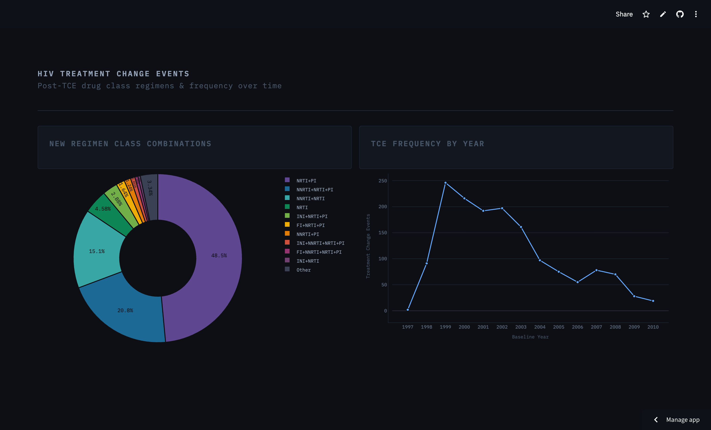
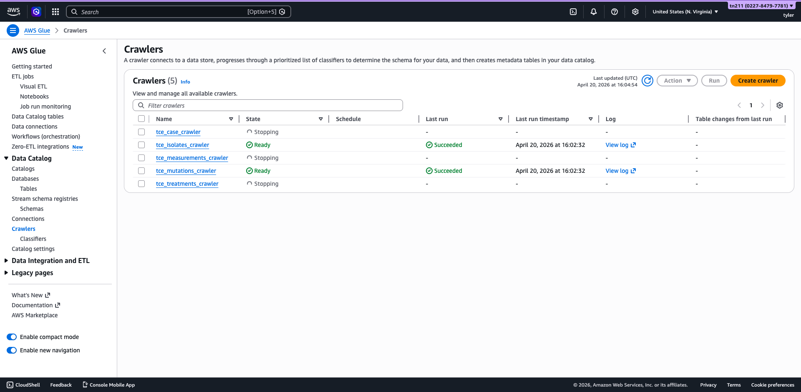
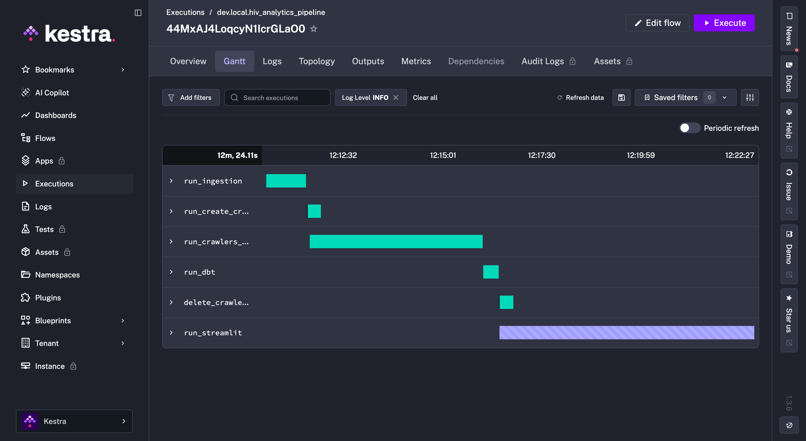
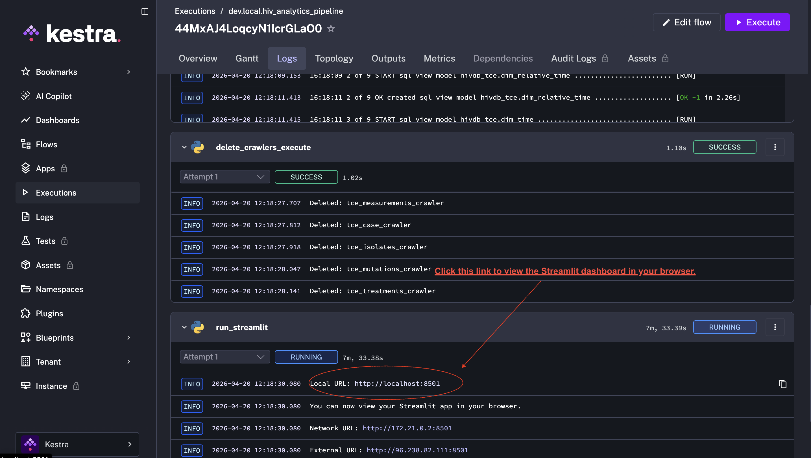

# hiv-resistance-analytics

---

## Problem Statement

HIV/AIDS therapies have improved by leaps and bounds since the early stages of the pandemic, when treatments (such as AZT monotherapy) were either ineffective or were accompanied by burdensome side-effects that lowered quality of life. However, there are still situations where patients need to switch regimens due to inadequate response. HIV is known to rapidly mutate, and these genetic changes sometimes confer resistance to one or more antiretroviral drugs (ARVs). In the interests of public health, genomics, and drug development, various research groups around the world monitor this type of ARV resistance. 

One such group at Stanford University maintains the [HIV Drug Resistance Database (HIVDB)](https://hivdb.stanford.edu/). HIVDB (Fig. 1) contains many resources for researchers, including a repository of Treatment Change Episodes (TCEs), where individual patients, their clinical metrics (viral load, CD4 count, etc.), and their drug regimens are stored as a catalogue of XML files. (Note: while I do not have permission to redistribute this dataset, anybody who registers as an HIVDB user and emails the admin can be granted access.)

<figure>
  
  <figcaption>
    
<strong>Figure 1:</strong> Screenshot of the HIVDB homepage.

  </figcaption>
</figure>

I wanted to gain insights into which regimens, either monotherapy or combinations of drug classes, patients tended to switch to after a TCE. Additionally, I wanted to see if the frequency of TCEs have changed over time. The XML format's extensible nature lends itself to these types of data structures, with each individual file containing dozens of headers and categories (Fig. 2). While this is valuable data, this current format is incredibly complex and difficult to query. Therefore, an additional challenge was finding a new way to structure the data.

<figure>
  
  <figcaption>
    
<strong>Figure 2:</strong> Anatomy of the XML data structure.

  </figcaption>
</figure>

---

## Objectives

I set out to engineer an end-to-end analytics pipeline that performs the following essential operations:

1. Extracts raw XML data and converts it into Parquet file(s).
2. Ingests the aggregated data into an AWS S3 storage bucket.
3. Uses AWS Glue to load the data into AWS Athena for queries.
4. Implements an analytics layer using dbt and the Athena API.
5. Design a Streamlit dashboard to gain insights into the data.
6. Orchestrate the entire process using Kestra and Docker.

---

## Architecture

I opted to use the AWS ecosystem as scaffolding for my basic ETL pipeline. After converting and aggregating the raw XML files into 5 Parquet files, the dataset was ingested into an [S3](https://aws.amazon.com/s3/) storage bucket. Next, [Glue](https://aws.amazon.com/glue/) crawlers were initialized for each Parquet directory and they set to work on interpreting the data structures and rendering them as tables. The tables were then loaded into [Athena](https://aws.amazon.com/athena/), where the resulting schema could be queried by SQL. The tripartite stack of S3 + Glue + Athena can be conceptualized as a "lakehouse"-style architecture, where the lines are blurred between traditional data lake and data warehouse functionality. One additional advantage of using Athena is that, like Google BigQuery, it is a serverless analytics engine, which eliminates the hassle of managing compute resources. 

Once the schema were instantiated in Athena, an analytics layer was developed using the [dbt](https://www.getdbt.com/) platform. The `dbt-athena` [adapter](https://docs.getdbt.com/docs/local/connect-data-platform/athena-setup?version=1.10) allowed me to perform all these operations in my local development environment. The final analytics layer consisted of a simplistic star schema 'mart' architecture, with 1 'fact' table informed by 2 'dimensions' (drug regimens and time). This provided enough information to generate a 2-tile dashboard showing trends in regimens prescribed in response to TCE and changes in TCE frequency over time. The individual visualizations were prototyped using [Plotly](https://plotly.com/) before being turned into an interactive dashboard web-app using [Streamlit](https://streamlit.io/). Finally, Streamlit [Community Cloud](https://streamlit.io/cloud) was used to publish the [live web-app](https://appdashboardpy-s3yzguguluurcbwe6rr46y.streamlit.app/), while also providing simple CI/CD functionality alongside GitHub.

After developing the individual components, they were joined into a pipeline using a [Kestra](https://kestra.io/) flow for orchestration. When the [Docker](https://www.docker.com/) container is run, the entire repository is mounted as a volume inside Kestra. The [uv package manager](https://docs.astral.sh/uv/) is used for easy reproducibility, so when a user runs the flow all dependencies are automatically added to the Docker container. The Kestra flow handles every step of the ETL pipeline, followed by the dbt transformations, before running the Streamlit app inside the container. Kestra's routing features expose the correct ports to the local environment so that it is possible to view the dashboard from any browser. Finally, [Terraform](https://developer.hashicorp.com/terraform) was used to implement infrastructure-as-code, which simplifies the provisioning of AWS resources and further enhances reproducibility. 

Here is a simplified overview of the stack used for my project:

| **Functionality**      | **Platform** |
| ---------------------- | ------------ |
| Infrastructure-as-code | Terraform    |
| Containerization       | Docker       |
| Orchestration          | Kestra       |
| Data lake              | AWS S3       |
| Data loading           | AWS Glue     |
| Data warehouse         | AWS Athena   |
| Scripting language     | Python       |
| Query language         | SQL          |
| Data transformations   | dbt          |
| Visualizations         | Streamlit    |

---

## Dashboard

Here is a sample screenshot (Figure 3) of my 2-tile analytics dashboard, which was created using the Plotly and Streamlit libraries. The [dashboard is hosted](https://appdashboardpy-s3yzguguluurcbwe6rr46y.streamlit.app/) as a live, interactive web-app on the Streamlit Community Cloud. It contains a donut plot tracking the most common ARV drug class combinations prescribed to patients after a TCE. It also shows a line graph of the frequency of TCEs by year, from 1997 to 2010 only. Note that this is simply the frequency of TCEs captured in the dataset, which is not necessarily representative of broader epidemiological trends. However, the fact that TCEs peaked in 1999, which is early on after the introduction of HAART (highly-active anti-retroviral therapy) regimens makes sense as treatments have only become more effective in subsequent years.

<figure>
  
  <figcaption>
    
<strong>Figure 3:</strong> Screenshot of the dashboard on Streamlit Community Cloud.

  </figcaption>
</figure>

---

## Instructions:

1. Clone this repo and navigate to the root directory (`/hiv-resistance-analytics/`).

2. Set up an AWS account if you do not already have one. You also need to visit `orchestration/.env` and populate the fields with details about your local environment so that Kestra can find your secrets.

3. You can either provision AWS resources manually or tun `terraform apply` to have it provision resources for you.

<figure>
  
  <figcaption>
    
<strong>Figure 4:</strong> Screenshot of the Glue crawlers overview.

  </figcaption>
</figure>

4. Navigate to the `/orchestration/` directory and run `docker compose up -d`to start the Kestra instance. Navigate to the flows tab an choose the hiv analytics flow, then press execute.

<figure>
  
  <figcaption>
    
<strong>Figure 5:</strong> Screenshot of a successful Kestra run.

  </figcaption>
</figure>
   
5. Click the link in the logs to view the Streamlit app. 

<figure>
  
  <figcaption>
    
<strong>Figure 6:</strong> Screenshot showing which link to clink to open the Streamlit app in your browser.

  </figcaption>
</figure>

