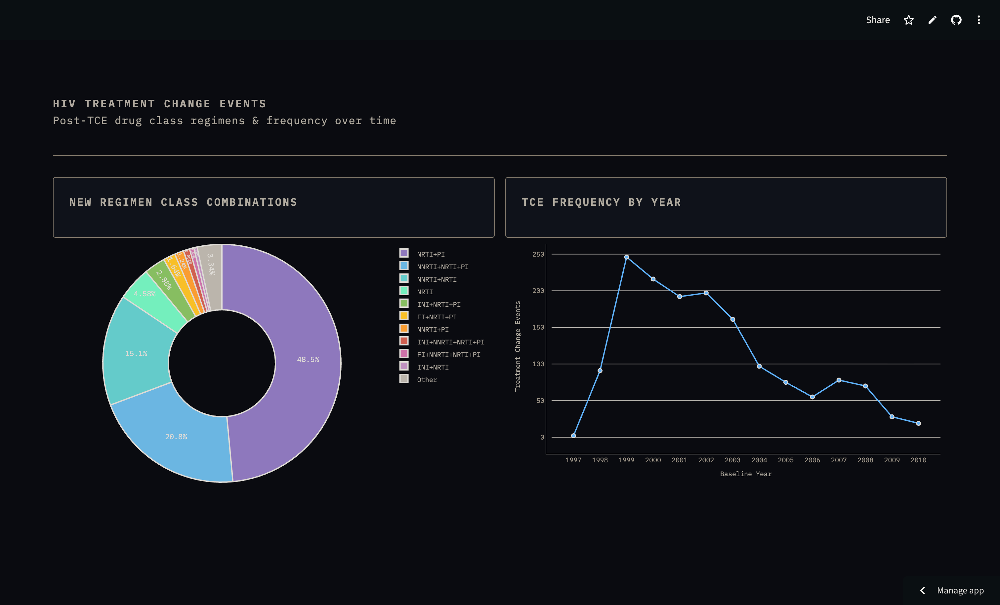

# hiv-resistance-analytics

## Overview:

This is still a work in progress, but the gist of my project is a data engineering pipeline and analytics engine using HIV drug resistance data from Stanford University's [HIVDB](https://hivdb.stanford.edu/). Eventually, I plan on piping in supplementary data from chemical and/or pharmacology database(s), but the Stanford dataset will comprise the core of my data lakehouse.

I've used `Terraform` to automate resource provisioning, and then `Kestra` will be used for the actual orchestration once the resources are online. Additionally, `Docker` will be used for reproducibility and for hosing my Kestra instance. I used `dlt` to extract the datasets from HIVDB's servers into a local `duckDB` database. 

Next, I used `boto3` (Amazon AWS's [Python API](https://aws.amazon.com/sdk-for-python/)) to ingest the datasets into `AWS S3` storage as parquet files. `AWS Glue` then read each of the parquet files and generated tables from them. The tables were loaded inside `AWS Athena`, which is a serverless analytics platform somewhat analogous to BigQuery. The combination of Glue and Athena on top of S3 storage can be conceptualized as a "lakehouse" architecture, blurring the lines between traditional data lakes and data warehousing. 

Now that data is loaded, `dbt` will be used perform transformations. Once I have my final datasets and have identified which analytics I want to present to my audience, I will upload my final tables into [`Supabase`](https://supabase.com/). I am already familiar with this platform and have used it to built apps in the past, so it was a natural choice for me. At its core, Supabase provides a cloud-based Postgres database (which actually uses AWS under the hood). And then its Javascript/Python APIs make it easy to develop frontends and attach them to PG backends. In this case, I'm planning on using Streamlit to build my dashboard. 

## Instructions:

1. Clone the repo and navigate to the root directory (`/hiv-resistance-analytics/`). Run `uv sync` to install all dependencies.
2. Run `terraform apply` to provision resources (note: you need to setup the AWS + Supabase accounts first, if you don't have them yet.)
3. Navigate to the `/orchestration/` directory and run `docker compose up -d`to start the Kestra instance. All of the workflows can be found in `/orchestration/flows` in case Kestra does not see them automatically.
4. Run the `hiv_pipeline.yml` flow to begin pipeline orchestration.
5. Once it's completed, login to Athena to check on your tables.
6. Now you're ready to transform data using `dbt` and the AWS API.

## Dashboard

Here is a sample screenshot of my 2-tile analytics dashboard, which was created using the Plotly and Streamlit libraries. The [dashboard is hosted](https://appdashboardpy-s3yzguguluurcbwe6rr46y.streamlit.app/) as a live, interactive web-app on the Streamlit Community Cloud. It contains a donut plot tracking the most common ARV drug class combinations prescribed to patients after a TCE. It also shows a line graph of the frequency of TCEs by year, from 1997 to 2010 only. Note that this is simply the frequency of TCEs captured in the dataset, which is not necessarily representative of broader epidemiological trends. However, the fact that TCEs peaked in 1999, which is early on after the introduction of HAART (highly-active anti-retroviral therapy) regimens makes sense as treatments have only become more effective in subsequent years.

<figure>

<figcaption>
<strong>Figure 1:</strong> Screenshot of the dashboard on Streamlit Community Cloud.
</figcaption>
</figure>